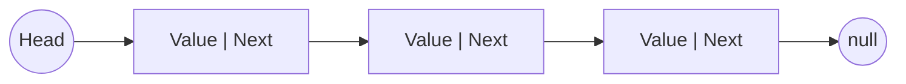

# Linked List kata

## Description
Une liste chaînée est une collection d'éléments de même type, elle est composée de nœuds contenant chacun une valeur et un pointeur vers le nœud suivant (vide si pas de nœud suivant).

## Représentation programmatique
- une classe Node pour représenter un nœud
- une classe LinkedList pour représenter la collection et manipuler la structure de donnée et contient la référence du premier nœud de la chaîne 

NB: **pour cet exercice, considérons que les valeurs stockées sont des nombres**

## Kata
### Étape 1 - Implémentation de la structure de donnée
#### Règles
- une nouvelle instance de Node n'a pas d'élément suivant
- une nouvelle instance de LinkedList est vide

### Étape 2 - Méthode append
#### Règles
- append est une méthode de LinkedList
- append prend un argument de type number
- append permet de rajouter un élément en fin de chaîne

### Étape 3 - Méthode prepend
#### Règles
- prepend est une méthode de LinkedList
- prepend prend un argument de type number
- prepend permet de rajouter un élément en début de chaîne

### Étape 4 - Méthode remove
#### Règles
- remove est une méthode de LinkedList
- remove prend un argument de type number
- remove permet de supprimer **la première occurrence** de la valeur passée en paramètre

### Étape 5 - Méthode size
#### Règles
- size est une méthode de Linked List
- size retourne le nombre de nœuds courants dans la liste chaînée